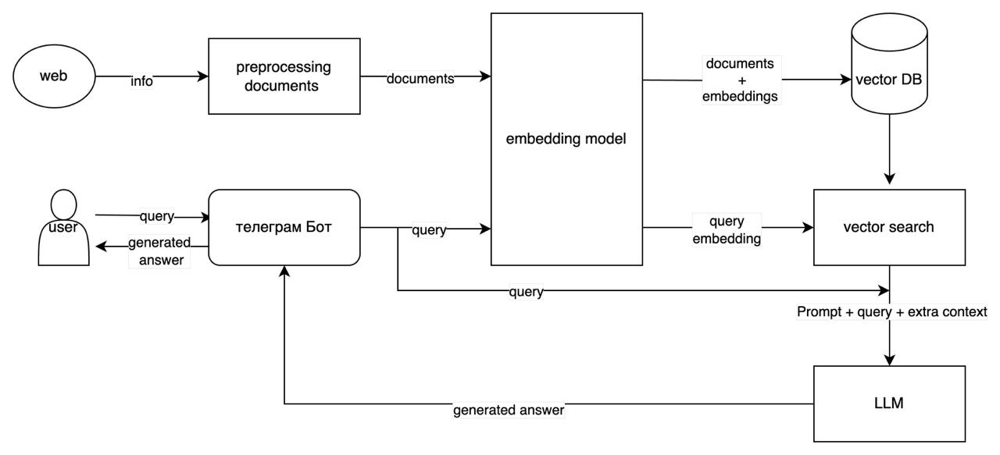

# SFNBOt — RAG-бот с FAQ и генерацией ответов

**SFNBOt** — это Telegram-бот, реализующий Retrieval-Augmented Generation (RAG) подход: он обрабатывает пользовательские запросы, извлекает релевантные фрагменты из базы знаний и генерирует ответы с помощью LLM. Встроена поддержка FAQ, пользовательского system prompt и гибкой настройки модели.

---

## Возможности

- Поиск и извлечение ответов из FAQ и общего контекста
- Генерация ответов с помощью LLM (GigaChat / локальных моделей)
- Векторная база на ChromaDB
- Обработка естественного языка с использованием эмбеддингов
- Настройки модели и порогов (`faq_threshold`, `rag_threshold`) через конфигурацию
- Парсинг FAQ с сайта (через Selenium)

---

## Архитектура



### Описание компонентов:

- **Web → Preprocessing documents**  
  Веб-источники парсятся и обрабатываются (например, через `faq_parsing.py`) в виде чистых текстов.

- **Preprocessing → Embedding model**  
  Документы преобразуются в эмбеддинги с помощью выбранной модели (например, `intfloat/e5-base-v2`).

- **Embedding model → Vector DB**  
  Полученные эмбеддинги документов сохраняются в векторную базу (`ChromaDB`).

- **User → Telegram Bot**  
  Пользователь отправляет запрос в Telegram. Бот принимает текст и перенаправляет его на обработку.

- **Bot → Embedding model → Vector Search**  
  Запрос преобразуется в эмбеддинг, по которому осуществляется поиск похожих фрагментов в базе.

- **Vector Search → LLM**  
  Найденный контекст + сам запрос объединяются в prompt и передаются LLM (GigaChat и др.).

- **LLM → Bot → User**  
  LLM генерирует ответ, который возвращается пользователю в Telegram.

---

## Структура проекта

```text
.
├── base_model.py      # Настройки модели, эмбеддеров и токенизации
├── faq_parsing.py     # Автоматический парсинг FAQ с сайта
├── llm_core.py        # Класс взаимодействия с языковой моделью
├── vectordb.py        # Класс взаимодействия с ChromaDB
├── rag_engine.py      # Основной движок RAG (извлечение + генерация)
├── run.py             # Точка входа: запуск Telegram-бота
├── chroma_store/      # Папка с собранной векторной базой знаний
├── *.jsonl            # Исходные документы, из которых построен `chroma_store`
```

---

## Установка

1. Клонируйте репозиторий
2. Установите зависимости:

```bash
pip install -r requirements.txt
```

## Установка через conda (Python 3.10.16)

Рекомендуется использовать изолированное окружение с Python **3.10.16**.

```bash
conda create -n investbot python=3.10.16
conda activate investbot
pip install -r requirements.txt
```

3. Создайте файл `.env` в корне проекта со следующим содержимым:

```env
TELEGRAM_KEY=your_telegram_bot_token
AUTH_KEY=optional_auth_key
DB_PATH=path_to_chroma_db
COLLECTION_NAME=your_collection
```

---

## Команды бота в Telegram

- `/start` — запуск бота
- `/settings` — просмотр текущих параметров модели
- Ввод текста — бот обрабатывает вопрос и отвечает на основе RAG

---

## Тесткейсы
[Посмотреть тесткейсы](./test_cases.md)

---


## Рекомендации по улучшению системы

1. **Добавить защиту от падения LLM**  
   Реализовать fallback-механику: при недоступности основной модели — автоматически использовать альтернативную (резервную) LLM, например, локальную или другую облачную.

2. **Гибкая настройка бота внутри Telegram**  
   Добавить больше параметров, доступных для настройки прямо через интерфейс Telegram (пороговые значения, выбор модели, лимиты), с разграничением доступа — только для разработчиков.

3. **Дообучение кастомных моделей**  
   - Улучшить эмбеддер для повышения точности поиска релевантных фрагментов.  
   - Дообучить SLLM под специфику данных, чтобы лучше обрабатывать типовые запросы.

4. **Управление фрагментами (чанками)**  
   Добавить возможность вручную добавлять, редактировать или удалять текстовые фрагменты через интерфейс или файл — это упростит взаимодействие с базой.

5. **Поддержка диалога (историчности)**  
   Вести ограниченный диалоговый контекст, чтобы бот учитывал предыдущие сообщения пользователя и мог вести более естественный разговор.

6. **Логирование и аналитика запросов**  
   Собирать статистику: какие запросы чаще всего задаются, какие вызывают ошибки, какие ответы берутся из кэша — это может поможет улучшить бота.

7. **Модерация ответов**  
   Возможность просматривать, корректировать ответы, предлагаемые LLM, перед отправкой пользователю.

8. **Модерация запросов пользователя**
    Проверка запросов пользователя на корректность.

9. **Авто обновлений базы**  
   Добавить фоновый процесс для регулярного перепарсивания источников и обновления эмбеддингов без необходимости перезапуска системы.


---


## Рекомендации улучшения архитектуры


### Что улучшено:

1. **Document Store + Vector DB**  
   Разделение структуры хранения:  
   - `Document Store` хранит исходные документы  
   - `Vector DB` — только векторы (облегчает обновление, управление и масштабирование)

2. **Кэширование запросов**  
   Добавлена промежуточная проверка:
   - Сначала запрос ищется в `Cache DB` (ответы на часто задаваемые вопросы)
   - Если совпадений нет — идёт обычный RAG-процесс

3. **Двухэтапный поиск**  
   - `Cache search` выполняется быстро и экономит вызовы LLM  
   - `DB search` активируется только при отсутствии релевантного ответа в кэше

4. **Условная маршрутизация**  
   Запрос сначала идёт через кэш-стратегию → если не найден ответ → сбор контекста из базы → вызов LLM.

5. **Экономия вычислительных ресурсов**  
   Частые запросы обслуживаются без повторного вызова моделей эмбеддингов и LLM.

---

### Выгоды от такой архитектуры:

- Повышение скорости ответа  
- Снижение затрат на вызовы LLM  
- Повторное использование ответов (кэш)  
- Гибкость масштабирования компонентов  
- Более чистая логика разделения данных и векторов


---

## Лицензия

Данный проект выполнен в рамках тестового задания для компании Современные Фонды Недвижимости.
Предназначен исключительно для ознакомления и оценки технических навыков автора. Не предназначен для коммерческого использования.

---

## 👤 Автор

**Шилов Пётр**  
    [shilovpetr64@gmail.com](mailto:shilovpetr64@gmail.com)  
    [GitHub](https://github.com/petr1shilov)

